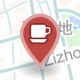
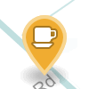
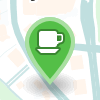

# Awesome CN Café

那些网速快咖啡好的咖啡馆。不同颜色的标记代表不同的下载速度。

<table>
<tr><th>标记</th><th>下载速度</th><th>色值</th></tr>
<tr><td></td><td>0 ~ 4 Mbps</td><td>#C24740</td></tr>
<tr><td></td><td>4 ~ 10 Mbps</td><td>#F3AE1A</td></tr>
<tr><td></td><td>10+ Mbps</td><td>#50C240</td></tr>
</table>

## 城市列表

* [北京 (125)](beijing.geojson)
* [上海 (63)](shanghai.geojson)
* [南京 (4)](nanjing.geojson)
* [武汉 (5)](wuhan.geojson)
* [杭州 (11)](hangzhou.geojson)
* [广州 (3)](guangzhou.geojson)
* [深圳 (16)](shenzhen.geojson)
* [贵阳 (2)](guiyang.geojson)
* [成都 (5)](chengdu.geojson)
* [南昌 (1)](nanchang.geojson)
* [呼和浩特 (1)](hohhot.geojson)
* [洛阳 (1)](luoyang.geojson)
* [芜湖 (2)](wuhu.geojson)
* [青岛 (1)](qingdao.geojson)
* [沈阳 (1)](shenyang.geojson)
* [哈尔滨 (1)](harbin.geojson)

## 贡献

欢迎发 pull request 添加你去过的咖啡馆。请通过浏览器或手机 app 等方式获取网络速度和经纬度，然后添加到相应的 [geoJSON](http://geojson.org/geojson-spec.html) 中。如果没有你所在的城市，请新建一个 geoJSON 文件。格式请参见 [shanghai.geojson](shanghai.geojson)。

### 通过手机 App

推荐使用 [Speedtest](http://www.speedtest.net/mobile/)（[iOS](https://itunes.apple.com/app/speedtest-net-mobile-speed/id300704847?mt=8) / [Android](https://play.google.com/store/apps/details?id=org.zwanoo.android.speedtest)），既可测试网络速度也能获取当前经纬度。

### 通过浏览器

请用 [Speedtest](http://speedtest.net) 或其他工具测试网络速度、Mapbox 的[显示经纬度](https://www.mapbox.com/mapbox.js/example/v1.0.0/select-center-form/)来获取经纬度。在 Google Maps 上通过 What’s here 取得的经纬度有些许偏差。如果你正在咖啡馆并且可以翻墙，可以使用 [whereami](https://xavierchow.github.io/whereami/) 来获得当前经纬度。

## 授权
[CC-BY](http://creativecommons.org/licenses/by/4.0/)
